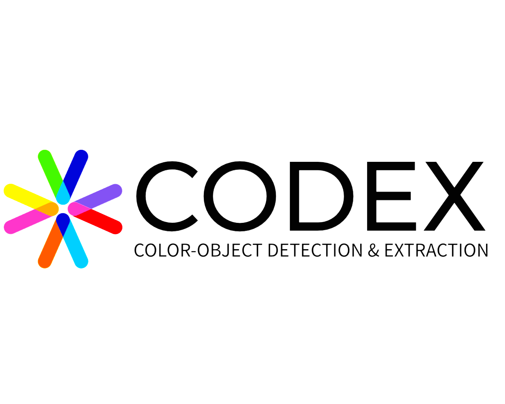

# CODEX: Color-Object Detection & Extraction

## Table of Contents

+ [About](#about)   
+ [The CODEX Segmentation Model](#about_model)
+ [Requirements](#requirements)
+ [Instructions & Usage](#instructions--usage)

## About

This program is the main executable for CODEX - Color-Object Detection and EXtraction.
It is a tool for interior designers or hobbyists to input an image of an interior space
and an object of interest, and the program will craft a curated color palette based on
the interior image and then compare the object of interest to the palette to determine
if it is a good fit for the interior space.

The program uses a custom trained YOLO (You Only Look Once) segmentation model to 
attempt to match the object of interest to a common object category. If the object
has a high enough confidence score, the model will apply isolating segmentation to 
the object of interest and use a finer-scale color matching scheme focused solely
on the object of interest. 

The intent behind this approach is to stretch the capabilities of this program so that
input images require little to no preprocessing. A user should be able to snap a picture
of an object of interest without worrying about separating it from other potential 
objects nearby, or about the consistency of the background.
    
Additionally, by matching the object of interest to a common object category, the segmentation 
and labeling can be used to extract multiple objects of interest from the same image, and 
compare all potential common objects to the interior color palette. An example of this use 
case might be the user snapping a photo of a catalog page, or taking a photo in a show room 
with multiple objects, and then be able to decide which object(s) would be the best fit for 
their interior space.

            
## The CODEX Segmentation model:  

The model was developed using a custom dataset that I created using Roboflow.
This allowed me to select a large amount of data from images that are FOSS around 
the web and on RoboFlow, and add hand-drawn segmentations to the dataset. Then, using
the Ultralytics YOLOv8 model, I was able to train the model extensively on the dataset
to acheive a high level of accuracy. 

The YOLOv8 model was chosen because it is a fast, lightweight model, that is trained on 
the MS COCO (Common Objects in Context) dataset, which contains 80 common object 
categories and over 300,000 images. Since many items in an interior space are a 
part of the COCO dataset, it was a good starting point for the CODEX model. Additional
categories not in the MS COCO dataset were added the CODEX model and trained. 

The source code for the model generation can be found in codex_model.py. Since model 
training is a time-intensive, and resource-intensive process, I have included the 
pre-trained model in the project files for runtime use and it is not required for 
the user to train the model themselves. 

        There are 16 supported object categories in the CODEX model:

        'bed' 'chair', 'clock', 'couch', 'curtain', 'dresser', 'lamp', 'light', 
        'pillow', 'plant', 'rug', 'shelf', 'stool', 'table', 'vase', 'wall-art'

The determination for color matching results is based on a weighted score 
of the relatedness of the objects most common HSV colors to the interior palette. 
A score greater than 0.5 is considered a match, and therefore a good fit for the
interior space.

The `codex_segmentation_v5` model and training dataset is hosted and available for download on roboflow. Reminder that downloading the raw dataset or model is NOT required. The trained CODEX segmentation model and weights are included in this repository. 
&emsp;   

<a href="https://universe.roboflow.com/codex-oqz5i/codex_segmentation_v5">
    </img>
</a>   
&emsp; &emsp;
<a href="https://universe.roboflow.com/codex-oqz5i/codex_segmentation_v5/model/">
    </img>
</a>

## Requirements:  

This project was developed on `Python 3.11.5`. Additional packages are listed in 
`requirements.txt` and can be installed using pip.

Addditional documentation available at

(technical paper link pending)

## Instructions & Usage  
Project Files: 

- `codex.py` - main executable
- `codex_common.py` - common functions used by codex.py
- `codex_model.py` - model training and testing functions
- `examples` - directory for example inputs 
- `codex.pt` - CODEX segmentation model 
- `yolov8m-seg.py` - YOLOv8 MS COCO Pre-trained segmentation model
- `requirements.txt` - list of dependencies

Usage:

   > python codex.py <reference_image_file> <object_of_interest_image_file>

  Arguments are optional. If ommited, the program will use included sample images:

   > python codex.py

Usage Example:

> python codex.py interior.jpg  couch.jpg

